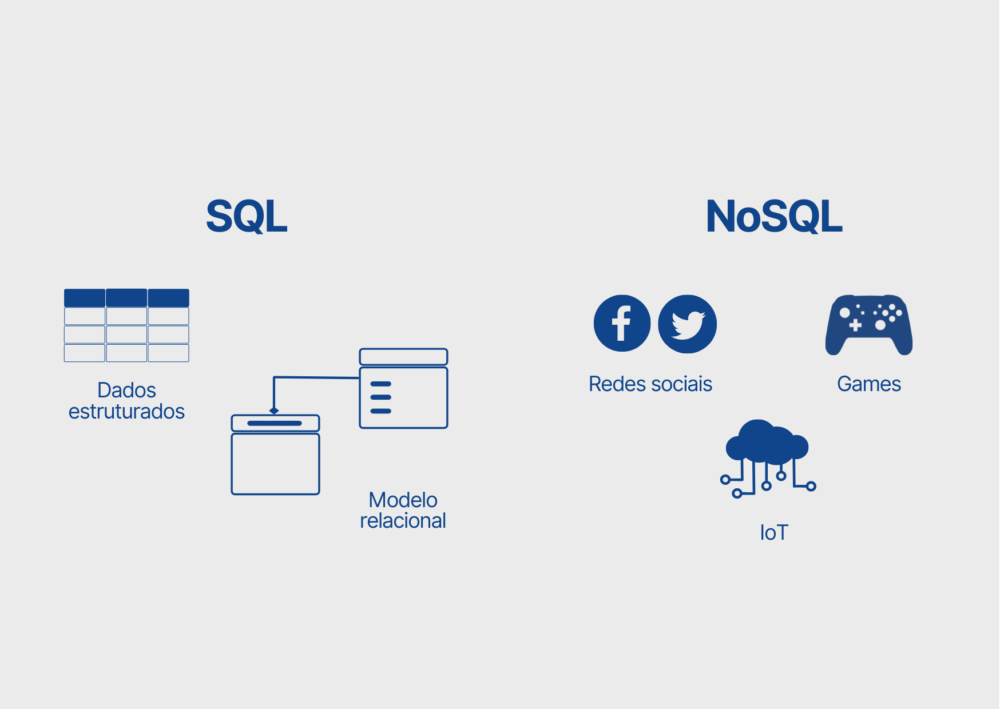
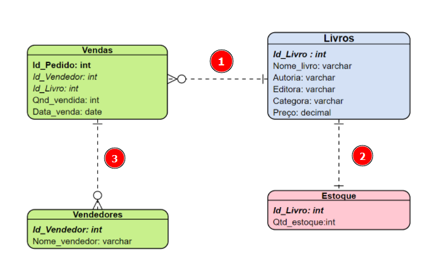
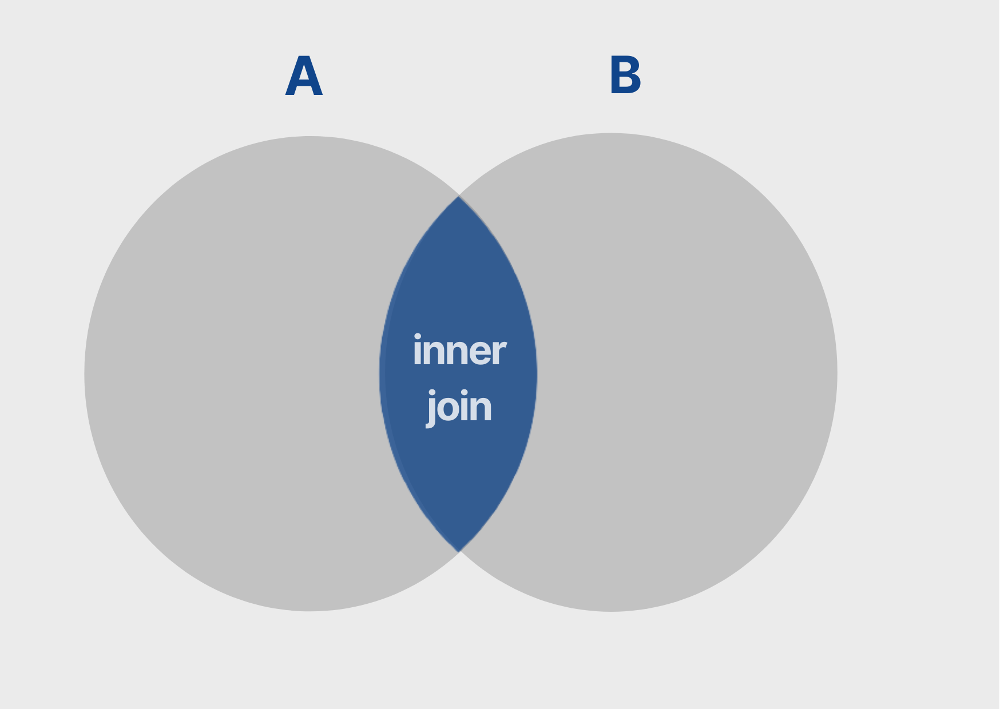
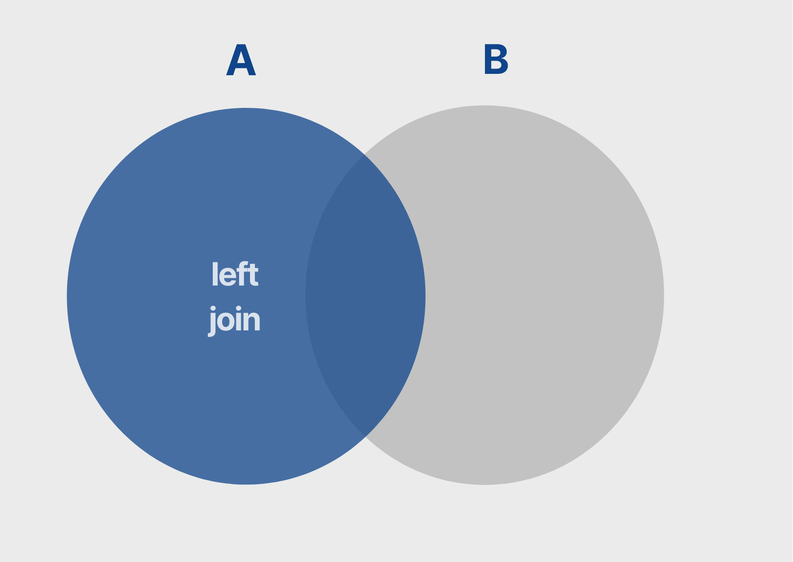
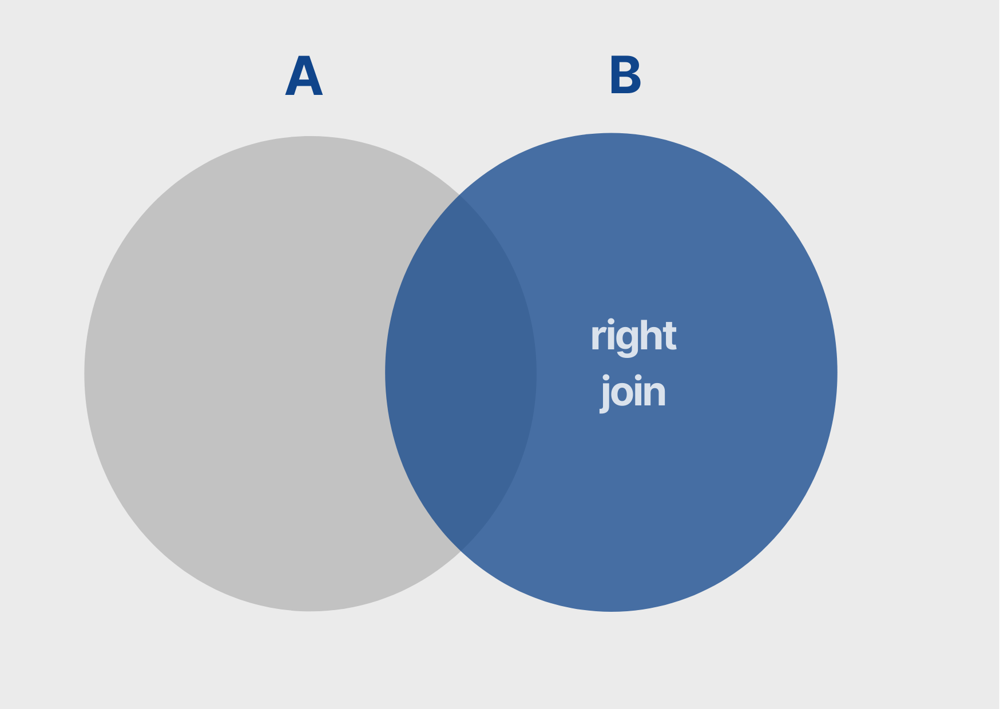
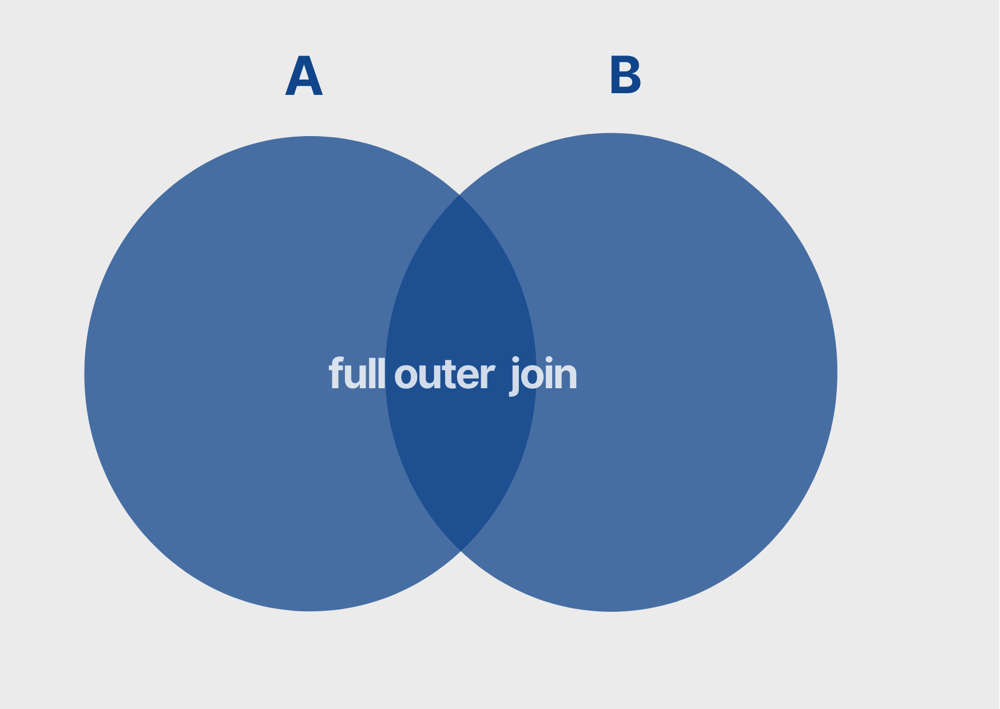

# Modelagem de banco de dados relacional: entendendo SQL

Conhecendo a importância da linguagem SQL para implementar um modelo relacional; entendendo a criação de esquema e tabelas; aprendendo como alterar tabelas para adicionar restrições e estabelecer a integridade referencial; definindo chaves primária e estrangeira em uma tabela; criando filtros para obter informações específicas; deletando e atualizando informações com SQL; realizando consultas no banco de dados; compreendendo a junção entre tabelas; e usando funções de agregação para trazer métricas.

1. [Introdução e instalação](#1-introdução-e-instalação)
2. [Esquemas e Tabelas](#2-esquemas-e-tabelas)
3. [Inserindo dados](#3-inserindo-dados)
4. [Consultando e alterando os dados](#4-consultando-e-alterando-os-dados)
5. [Unindo tabelas](#5-unindo-tabelas)

Saiba mais sobre o curso [aqui](https://cursos.alura.com.br/course/modelagem-banco-dados-relacional-sql) ou acompanhe minhas anotações abaixo. ⬇️

## 1. Introdução e instalação

### **Para saber mais: Conhecendo um pouco mais sobre SQL**

> SQL é uma sigla em inglês para Structured Query Language que pode ser livremente traduzida para Linguagem de Consulta Estruturada e é uma linguagem padrão para trabalhar com bancos de dados relacionais.

Leia mais [aqui](/Para%20saber%20mais/Aula%201%20-%20Atividade%203%20Para%20saber%20mais_%20conhecendo%20um%20pouco%20mais%20sobre%20o%20SQL.pdf).



Para trabalhar com modelos de dados estruturados, o SQL juntamente com o modelo relacional prevalece. Contudo, para dados não-estruturados o NoSQL é a melhor alternativa.

- ***SGBD utilizado no curso: [MySQL](https://dev.mysql.com/downloads/)***

## 2. Esquemas e Tabelas

### **Criando um esquema**

> Esquemas são grupos (coleções) de tabelas relacionadas. São estruturas lógicas utilizadas para armazenar os dados em um banco de dados. Esquemas definem os objetos e atributos do banco. - [Bóson Treinamentos](http://www.bosontreinamentos.com.br/bancos-de-dados/qual-a-diferenca-entre-esquema-e-banco-de-dados/)

Antes de criar as tabelas de um banco, é necessário criar um `esquema`. Nele serão armazenadas todas as tabelas e configurações da base de dados.

***Criando um esquema:***

```sql
CREATE SCHEMA cdl;
```

### **Criando tabelas**

***Criando uma tabela:***

Para criar uma tabela é preciso já ter um esquema e definir que ele será utilizado para armazenar a tabela criada. A tabela recebe colunas e atributos que caracterizam sua funcionalidade no banco.

- Números são identificados como `INT`
- Textos são identificados como `VARCHAR`
- Preços são identificados como `DECIMAL`

Além disso, colunas podem ou não ser nulas e isso é definido na criação da tabela. O argumento `NOT NULL` define que ao cadastrar um livro, todas as informações devem ser preenchidas. Por fim, a tabela recebe uma chave primária que fará relação com outras tabelas do banco.

```sql
USE cdl;

CREATE TABLE livros (
	cod_livro INT NOT NULL,
    nome_livro VARCHAR(100) NOT NULL,
    autoria VARCHAR(100) NOT NULL,
    editora VARCHAR(100) NOT NULL,
    categoria VARCHAR(100) NOT NULL,
    preco DECIMAL(5, 2) NOT NULL,
    
    PRIMARY KEY (cod_livro)
);
```

### **Para saber mais: Principais tipos de dados em SQL**

Categoria | Descrição | Exemplo | Comando
--------- | --------- | ------- | -------
Numéricos exatos | Números inteiros e decimais | 9 é inteiro e 9.78 é decimal | int, smallint, decimal, numeric
Numéricos aproximados | Números de ponto flutuante | 7.90 é float | float, real, double precision
Cadeias de caracteres | Textos de tamanhos fixos e variáveis | “modelagem” é char(9) | char(n), varchar(n)
Valores lógicos | Verdadeiro ou falso | True é verdadeiro | filtro de comparação
Data | Datas, dias, mês, anos | 26-02-2023 é DD-MM-YYYY | date
Tempo | Horas, minutos, segundos | 10:59:13 é HH:MM:SS | timestamp

### **Integridades referenciais**

Todas as tabelas foram criadas, mas ainda não existe relação entre elas. Para isso, é necessário criar uma chave estrangeira. É possível fazer isso alterando a tabela, adicionando a chave em questão e referenciando a tabela relacionada. Além disso, pode-se adicionar características para manter a integridade dos dados no ato da alteração das tabelas.

***Alterando uma tabela:***

```sql
ALTER TABLE estoque ADD CONSTRAINT fk_estoque_livros
FOREIGN KEY (cod_livro)
REFERENCES livros (cod_livro)
ON DELETE NO ACTION
ON UPDATE NO ACTION
```

> Para estabelecer a relação entre duas tabelas já criadas é preciso alterar uma tabela definindo o campo que será a chave estrangeira e finalizando fazendo referência ao campo de outra tabela.

- `ALTER TABLE` alterar uma tabela
- `ADD CONSTRAINT` adiciona uma restrição de chave para relacionar duas tabelas
- `FOREIGN KEY` chave estrangeira
- `REFERENCES` indica a tabela de onde vem a chave estrageira
- `ON DELETE` ao excluir...
- `ON UPDATE` ao atualizar...
- `NO ACTION` impede exclusão ou atualização caso ainda tenha dados daquele registro em outra tabela.



Os números 1, 2 e 3 indicam que existem relações entre as tabelas.

## 3. Inserindo dados

### **Praticando o comando INSERT**

Para adicionar informações nas tabelas, ou seja, criar linhas para as colunas definidas anteriormente, deve-se utilizar o comando `INSERT INTO ... VALUES (...)` em que, nos três pontinhos, coloca-se o nome da tabela e os dados de cada coluna, respectivamente.

***Inserindo dados:***

```sql
INSERT INTO livros VALUES (
	1,
    "Percy Jackson e o Ladrão de Raios",
    "Rick Riordan",
    "Intríseca",
    "Aventura",
    40.90
);
```

Cada valor acima, separado por vírgula, corresponde a uma coluna da tabela. Ao executar o código, têm-se:

    cod_livro: 1
    nome_livro: Percy Jackson e o Ladrão de Raios
    autoria: Rick Riordan
    editora: Intríseca
    categoria: Aventura
    preco: 40.90

Lembrando que o comando `NOT NULL` impede valores vazios, então todos os dados precisam ser definidos ou será retornado um erro na execução do código.

### **Inserindo múltiplas linhas**

Os registros das tabelas podem ser inseridos de várias formas. A forma manual se divide em duas partes: item por item ou um conjunto de itens. Os itens podem ser adicionados fora de ordem também, contudo é preciso indicar a que coluna se refere o texto. A forma automática é feita através do upload de um arquivo, com um padrão similar ao da tabela existente.

```sql
-- Inserindo item por item
INSERT INTO livros VALUES
(2, "A volta ao mundo em 80 dias", "Júlio Verne", "Principis", "Aventura", 18.75);

INSERT INTO livros VALUES
(3, "O Cortiço", "Aluísio de Azevedo", "Principis", "Romance", 21.90);

INSERT INTO livros VALUES
(4, "Dom Casmurro", "Machado de Assis", "Principis", "Ficção", 16.00);

-- Inserindo vários itens de vez
INSERT INTO livros VALUES
(2, "A volta ao mundo em 80 dias", "Júlio Verne", "Principis", "Aventura", 18.75),
(3, "O Cortiço", "Aluísio de Azevedo", "Principis", "Romance", 21.90),
(4, "Dom Casmurro", "Machado de Assis", "Principis", "Ficção", 16.00);

-- Inserindo itens desordenados
INSERT INTO livros (categoria, autoria, nome_livro, editora, cod_livro, preco)
VALUES ("Biografia", "Anne Frank", "O Diário de Anne Frank", "Record", 10, 40.40);

-- Inserindo vários itens desordenados
INSERT INTO livros
	(categoria, autoria, nome_livro, editora, cod_livro, preco)
VALUES
	("Biografia", "Malala Yousafzai", "Eu sou Malala", "Companhia das Letras", 11, 33.53),
	("Biografia", "Michelle Obama"  , "Minha história", "Objetiva", 12, 40.99);
```

Caso seja necessário excluir uma tabela, isso pode ser feito através do comando `DROP TABLE tabela`. Lembrando que é necessário desativa e reativar as restrições de chave estrangeira para realizar a exclusão, com:

```sql
SET FOREIGN_KEY_CHECKS = 0; -- desativa
SET FOREIGN_KEY_CHECKS = 1; -- ativa
```

## 4. Consultando e alterando os dados

A consulta dos dados inseridos é feita a partir do comando `SELECT` juntamente com o comando `FROM`. Isso quer dizer que para realizar a consulta é preciso indicar o que será mostrado e de onde o dado vem.

***Selecionando dados:***

```sql
-- O asterisco faz com que a consulta traga todos os dados da tabela
SELECT * FROM livros;

-- Indicando o nome da coluna, apenas os registros dela serão mostrados
SELECT nome_livro FROM livros;

-- O comando AS renomeia uma coluna para especificar melhor o conteúdo dela
SELECT cod_livro AS "Código do livro" FROM livros;
```

### **Filtros no SQL**

Os filtros em SQL são utilizados para restringir os dados que serão mostrados nas consultas. O filtro é feito com o comando `WHERE` e é necessário dizer a coluna em que o dado será filtrado e que valor receberá o filtro.

***Filtrando dados:***

```sql
-- Filtro simples
SELECT * FROM livros WHERE categoria = "Biografia";

-- Filtro composto
SELECT * FROM livros WHERE categoria = "Romance" AND preco < 48;

-- Filtro inverso
SELECT * FROM livros WHERE categoria = "Ficção" AND NOT editora = "Principis";

-- Filtro múltiplo
SELECT * FROM livros WHERE editora = "Principis" AND (categoria = "Aventura" OR categoria = "Ficção");
```

O filtro pode ser utilizando juntamente com outros comandos que criam operações nas consultas:

- `AND` adiciona um segundo filtro na consulta
- `OR` compara itens e traz apenas um deles
- `NOT` exclui um item ao realizar a consulta
- `LIKE` retorna o filtro com parte do texto (veja mais [aqui](/Para%20saber%20mais/Aula%204%20-%20Atividade%204%20Para%20saber%20mais_%20identificando%20parte%20dos%20valores.pdf))

O comando `LIKE` pode utilizar o símbolo de `%` para substituir qualquer valor na consulta, antes ou após uma letra. Por exemplo: Em uma lista de nomes de cidades, filtra-se apenas as que começam com a letra A.

```sql
SELECT cidade FROM * mapa WHERE cidade LIKE "A%"
```

### **Seleção distinta**

O comando `DISTINCT` é utilizado logo após o select para especificar que não serão mostrados valores duplicados. Isso quer dizer que apenas valores únicos, distintos serão consultados. É outra forma de filtrar dados, podendo ser utilizado com ou sem o where.

***Utilizando o distinct:***

```sql
SELECT DISTINCT * FROM vendas WHERE cod_vendedor = 1 ORDER BY cod_livro;
```

Além de todos os filtros e operações, já vistos, é possível também ordenar o resultado pelo nome da coluna ou pelo índice dela na consulta com o comando `ORDER BY`.

### **Alterando informações**

Um dos comandos que requer cuidado em sua utilização é o `DELETE`. Cuidado, pois caso não seja definido o que se quer deletar, ele pode acabar apagando toda uma tabela. *Então é importante lembrar de não usar delete sem where.*

***Deletando dados:***

```sql
-- Deleta o livro com código 8 da tabela
DELETE FROM livros WHERE cod_livro = 8;
```

Já o comando `UPDATE` serve para realizar alterações mais específicas. Juntamente com o `SET`, ele pode ser utilizado para modificar um único valor, uma célula da tabela.

***Atualizando dados:***

```sql
-- Multiplica o preço por 9% para realizar um desconto no valor dos livros
UPDATE livros SET preco = 0.9 * preco;
```

## 5. Unindo tabelas

### **Filtro usando duas tabelas**

O filtro `WHERE` pode ser utilizando para filtrar dados de uma tabela que também está em outra tabela, utilizando a coluna que relaciona ambas. Geralmente, a partir de uma chave primária/estrangeira. Também é possível agrupar o resultado para obter dados únicos na consulta.

```sql
-- Filtrando as vendas por vendedor e a quantidade vendida por cada um
SELECT vendas.cod_vendedor, vendedor.nome_vendedor, vendas.qtd_vendida
FROM vendas, vendedor WHERE vendas.cod_vendedor = vendedor.cod_vendedor;

-- # Filtrando as vendas por vendedor e agrupando pela soma da quantidade vendida
SELECT vendas.cod_vendedor, vendedor.nome_vendedor, SUM(vendas.qtd_vendida)
FROM vendas, vendedor WHERE vendas.cod_vendedor = vendedor.cod_vendedor
GROUP BY vendas.cod_vendedor;
```

Pode-se reduzir consultas ao dar um apelido (alias) para as tabelas. Esse comando já foi visto antes para renomear uma coluna. Utilizando `AS` e identificando a tabela com uma sigla, o código é reduzido. Veja mais [aqui](/Para%20saber%20mais/Para%20saber%20mais/Aula%205%20-%20Atividade%202%20Para%20saber%20mais_%20diminuindo%20a%20consulta.pdf).

***Unindo dados filtrados:***

```sql
-- O mesmo filtro acima, com o alias nas tabelas
SELECT vds.cod_vendedor, vdd.nome_vendedor, SUM(vds.qtd_vendida)
FROM vendas AS vds, vendedor AS vdd
WHERE vds.cod_vendedor = vdd.cod_vendedor
GROUP BY vds.cod_vendedor;
```

Outra forma de unir tabelas, mais comumente usado, é o comando `INNER JOIN`. Ao consultar um dado em uma tabela, pode-se chamar outra tabela para complementar a consulta, sem perda de dados. Para realizar a junção, basta substituir a vírgula entre as tabelas no from, pelo comando inner join e o where pelo comando on, veja:

***Unindo dados semelhantes:***

```sql
SELECT vds.cod_vendedor, vdd.nome_vendedor, SUM(vds.qtd_vendida)
FROM vendas vds INNER JOIN vendedor vdd
ON vds.cod_vendedor = vdd.cod_vendedor
GROUP BY vds.cod_vendedor;
```

    O comando `AS` é opcional ao renomear tabelas, mas fica visualmente melhor de se entender.

### **Para saber mais: funções de agregação - Métricas**

Além do `SUM` existem outras funções de agração que são utilizadas para resumir dados de uma tabela.

- `MAX` a partir de um conjunto de valores é retornado o maior entre eles;
- `MIN` analisa um grupo de valores e retorna o menor entre eles;
- `SUM` calcula o somatório dos valores de um campo específico;
- `AVG` realiza a média aritmética dos valores de uma determinada coluna;
- `COUNT` contabiliza a quantidade de linhas selecionadas.

***Utilizando funções de agregação:***

```sql
SELECT MAX(QTD_VENDIDA) FROM VENDAS;

SELECT MAX(QTD_VENDIDA) FROM VENDAS
GROUP BY(ID_VENDEDOR);
```

### **Left e Right join**

O `INNER JOIN` é uma interseção de dados. O join é similar aos conjuntos, sendo o inner a interseção. Há ainda outras formas de se unir dados como conjuntos. O left e o right são uniões em que os dados de uma das tabelas será mostrado em sua totalidade, enquanto os dados da outra tabela serão filtrados.

***Unindo dados específicos***

```sql
-- Trazendo a lista de livros que foram vendidos e as quantidades
SELECT livros.nome_livro, vendas.qtd_vendida
FROM livros LEFT JOIN vendas
ON livros.cod_livro = vendas.cod_livro;

-- Adicionando o where para trazer os livros que não foram vendidos
SELECT livros.nome_livro, vendas.qtd_vendida
FROM livros LEFT JOIN vendas
ON livros.cod_livro = vendas.cod_livro
WHERE vendas.qtd_vendida IS NULL;
```

### **Para saber mais: Tipos de junção**

> Quando temos informações em diferentes tabelas e queremos reunir uma única consulta é comum fazer junção entre tabelas. Para explicar a diferença entre os famosos Joins, é bem comum representarmos por Diagrama de Venn, onde cada círculo (conjunto) representa uma tabela do nosso modelo relacional.

- O `INNER JOIN` é a interseção entre A e B


- O `LEFT JOIN` traz A com dados de B


- O `RIGHT JOIN` traz B com dados de A


- O `FULL OUTER JOIN` é a união de A e B


Outros exemplos com join pode ser vistos [aqui](https://www.alura.com.br/artigos/join-em-sql). 

⬆️ [Voltar ao topo](#modelagem-de-banco-de-dados-relacional-entendendo-sql) ⬆️